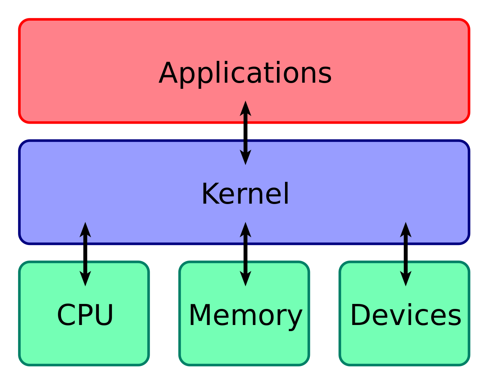

# Daily Knowledge

## Day 1

### Linux

- **Linux** is the **kernel**: the program in the system that allocates the machine's resources (CPU, memory and disk, etc.) to the other programs that you run.
- An **operating system** includes a kernel, compilers, editors, text formatters, mail software, graphical interfaces, libraries, games and many other things.
  - The **kernel** is an essential part of an operating system, but useless by itself; it can only function in the context of a complete operating system.

<p align="center"></p>

- Linux is normally used in combination with the GNU OS: the whole system is basically GNU with Linux added, or `GNU/Linux`.
- All the so-called “Linux” distributions such as Ubuntu, Kali Linux, are really distributions of GNU/Linux.

#### Terminal, Shell (Bash, zsh), `sh`

- **Terminal**: A program acts as a wrapper to enter commands
- **Shell**: A command line interpreter that receives and executes commands
  - Bash (Bourne-Again **SHell**) is one of the most commonly used Unix/Linux shells and is the default shell in many Linux distributions.
    - `$` when a shell is used interactively with user mode
    - `#` when a shell is used interactively with root mode
  - There are other shells available as well, such as Korn shell (`ksh`), C shell (`csh`), and Z shell (`zsh`).
- `sh` (or the Shell Command Language) is a _programming language_ described by the POSIX standard.
  - It has many implementations (ksh88, Dash, ...). Bash can also be considered an implementation of sh
  - `Bash` is a superset of `sh` with a more elegant syntax and more functionality such as scoped local variables and arrays. `sh` is a very minimalistic programming language.
  - Because sh is a specification, not an implementation, `/bin/sh` is a **symlink** (or a hard link) to an actual implementation on most POSIX systems.
    - In most GNU/Linux systems, `/bin/sh` used to point to `/bin/bash`
    - In macOS, zsh shell type `la /private/var/select` to know what `/bin/sh` will link to which. In this case, `sh -> /bin/bash`
    ```bash
    la /private/var/select
    # total 0
    # lrwxr-xr-x  1 root  wheel     9B Dec 15 22:43 sh -> /bin/bash
    ```

#### Environment Variable `$PATH`

- `$PATH` lists which directories the shell should search for programs

```bash
bash-5.2$: echo $PATH
# /usr/local/sbin:/usr/local/bin:/usr/sbin:/usr/bin:/sbin:/bin
```

#### `/proc` folder

- Contains files for monitoring processes
- Get the status information of a process: `/proc/PID/{status, cpu, memory, meminfo}`
  - Find more [Process specific entries in `/proc`](https://www.kernel.org/doc/html/latest/filesystems/proc.html)

```bash
cat /proc/25/status # get the overal status
cat /proc/25/mem    # get the memory information
```

### Linux Commands

- `/dev/null` is a virtual null device used to discard any output redirected to it.

#### File Descriptor

- `0`: `STDIN` (from the Key Board)
- `1`: `STDOUT` (display in the Monitor)
- `2`: `STDERR` (display in the Monitor)
  - For example: `bash run.sh >> logs/iris.log 2>&1` - `>> logs/iris.log` this will re-direct the `STDOUT` (`1`) from the process `run.sh` to the log file `iris.log` - `2>&1` this will re-direct the `STDERR` (`2`) to `STDOUT` (`1`), but from above, `STDOUT` (`1`) is re-directed to the log file, so `STDERR` (`2`) also be re-directed to the log file `iris.log`

#### File Writting

- `>` overwrites the file.
- `>>` appends to the file

```bash
echo "data science" >> ./data/test.txt # >> append
echo "math" > ./data/test.txt # > overwrite
```

- If you want to append multiple lines into a file, you can use `EOF`

```bash
cat << EOF >> ./data/test.txt # change << EOF >> to < EOF> will be overwrite
machine learning engineering
data engineering
EOF
```

### Bash Scripting

#### Shebang

- Bash scripts start with a **shebang** which is `#!`
- Shebang tells the shell to execute it via `bash` shell.
  - Shebang is simply an absolute path to the bash interpreter.

```Bash
#!/bin/bash

# This shebang is to tell the shell to use default bash, located at bin/bash

#!/opt/homebrew/bin/bash

# This shebang is to tell the shell to use "bash 5.2" which installed via HomeBrew
```

- It is good practice to write shebang lines using the `/usr/bin/env` command that will resolve to wherever the command lives in the system, **increasing the portability** of your scripts.
- `/usr/bin/env` will ensure the interpreter used is the first one on your environment's `$PATH`
  - For example: if place `!#/usr/bin/env bash` in your script, this bash version `/opt/homebrew/bin/bash` will be used instead of `/bin/bash` since in the `$PATH` variable, `/opt/homebrew/bin` is placed before `/bin`

```bash
echo $PATH
# /opt/homebrew/bin:/opt/homebrew/sbin:/usr/local/bin: .... :/usr/bin:/bin:/usr/sbin:/sbin:
```

- Note: Scripts need not necessarily be written in bash to be called from the terminal.
  - For example: The kernel knows to execute this script with a **python** interpreter with the shebang `#!/usr/bin/env python`

```Python
#############################
# in the python_script.py   #
#############################
#!/usr/bin/env python
import sys
for arg in reversed(sys.argv[1:]):
    print(arg)

#############################
# in the interactive shell  #
#############################
bash-5.2$ chmod +x python_script.py
bash-5.2$ ./python_script.py a b c
# c
# b
# a
```

#### Making a file executable

- If the executable bit (`x`) is set on a file (with a proper shebang), it can be executed directly by the users with that permission.
  - For example: after you `chmod a+x myscript.py`, instead of running `python3 myscript.py`, you can just run `./myscript.py`, provided that `myscript.py` has the shebang `#!/usr/bin/python3`
- You can give the file executable to the current user, group or all users or the combination of those below flags:
  - `u` for user
  - `g` for group
  - `o` for others
  - `a` for all users

```bash
chmod ug+x myscript.py # give both user and group executable permission
```

#### Variable Assignment

- To assign variables in bash, use the syntax `foo=bar`
  - Note: that `foo = bar` will not work since it is interpreted as calling the `foo` program with arguments `=` and `bar`
- To access the value of the variable with `$foo`

#### Function

- Bash uses a variety of special variables to refer to arguments, error codes, and other relevant variables.
  - `$0` Name of the script
  - `$1` to `$9` Arguments to the script.
    - `$1` is the first argument and so on.
  - `$_` Last argument from the last command.

```bash
#############################
# in the basic_script.sh    #
#############################

#!/opt/homebrew/bin/bash
mcd () {
    mkdir -p "$1"
    echo "Successfully create $1 folder"
}

#############################
# in the interactive shell  #
#############################

bash-5.2$ source ./basic_script.sh
bash-5.2$ mcd today
# Successfully create today folder
bash-5.2$ rmdir $_ # this will refer to the last arg from last command which is `today`
bash-5.2$ ls       # the today folder has been deleted
# basic_script.sh  data
```

#### Variable Assignment

- To assign variables in bash, use the syntax `foo=bar`
  - Note: that `foo = bar` will not work since it is interpreted as calling the `foo` program with arguments `=` and `bar`
- To access the value of the variable with `$foo`

### SQL

#### View & Snapshot (materialized views)

- `View` is a virtual table that does not store its own data but rather displays data that is stored in other tables.
  - For example: create a view that only contains transactions belong to government agencies' accounts (IRAS, AGD)

```sql

CREATE VIEW transactions AS
    SELECT
        id_number,
        name,
        transaction_date
    FROM
        customers;

-- After we execute this statement, the transactions object will be available in Views.
SELECT * FROM transactions;
```

- `snapshot` is a _read-only_ replica of a target master table from a single point in time.
  - snapshots are updated from one or more master tables through individual batch updates, known as a **refreshes**
  - snapshots can be helpful for regional offices or sales forces that do not require the complete corporate data set
  - For example: master table is Murex table that contains all history records about a murex transaction, but we can have a snapshot of murex table to keep track on the latest status of that transaction instead of all history records
