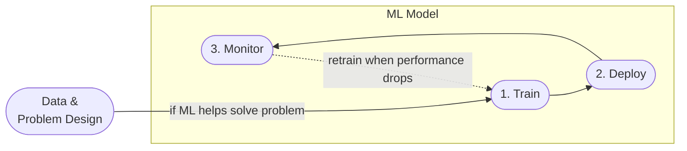

# Introduction to MLOps

## What is Machine Learning Operationalisation (MLOps) ?

MLOps brings DevOps principles to machine learning. It is a set of best practices to put ML models into production and automate the life-cycle.

MLOps could help to

- Track model iterations and reproduce results reliably
- Monitor model performance and deliver domain-specific metrics for ML
- Deliver models safely and automatically into production.

## MLOps Life-cycle

- **Data & Problem Design**: Choose machine learning to solve a problem when there is no other more straightforward approach and the data has sufficient quality.
- 1️⃣ **Train**: Train and evaluate ML models and choose the best performing one.
- 2️⃣ **Deploy**: Integrate the chosen model into the production environment (web service, module, embedded system, etc.)
- 3️⃣ **Monitor**: Capture the model's performance in the production environment and define a threshold for an acceptable value.

## MLOps Maturity Model

The extent to which MLOps is implemented into a team or organization could be expressed as maturity. A framework for classifying different levels of MLOps maturity is listed below:

| Level |              | Overview | Use Case | 
|----:|--------------|----------|----------|  
| 0️⃣  | **No MLOps** | <ul><li>ML process highly manual</li><li>poor cooperation</li><li>lack of standards, success depends on an individual's expertise</li> </ul> | <ul><li>proof of concept (PoC)</li><li>academic project</li></ul> |
| 1️⃣  | **DevOps but no MLOps** | <ul><li>ML training is most often manual </li><li>software engineers might help with the deployment</li><li>automated tests and releases</li> </ul> | <ul><li>bringing PoC to production</li></ul> |
| 2️⃣  | **Automated Training** | <ul><li>ML experiment results are centrally tracked </li><li>training code and models are version controlled</li><li>deployment is handled by software engineers</li> </ul> | <ul><li>maintaining 2-3+ ML models</li></ul> |
| 3️⃣  | **Automated Model Deployment** | <ul><li>releases are managed by an automated CI/CD pipeline</li><li>close cooperation between data and software engineers</li><li>performance of the deployed model is monitored, A/B tests for model selection are used</li></ul> | <ul><li>business-critical ML services</li></ul> |
| 4️⃣  | **Full MLOps Automated Operations** | <ul><li>clearly defined metrics for model monitoring</li><li>automatic retraining triggered when passing a model metric's threshold</li> </ul>  | <ul><li>use only when a favorable trade-off between implementation cost and increase in efficiency is likely</li><li>retraining is needed often and is repetitive (has potential for automation)</li></ul> |

Read more on maturity, visit [Microsoft's MLOps maturity model](https://docs.microsoft.com/en-us/azure/architecture/example-scenario/mlops/mlops-maturity-model).
