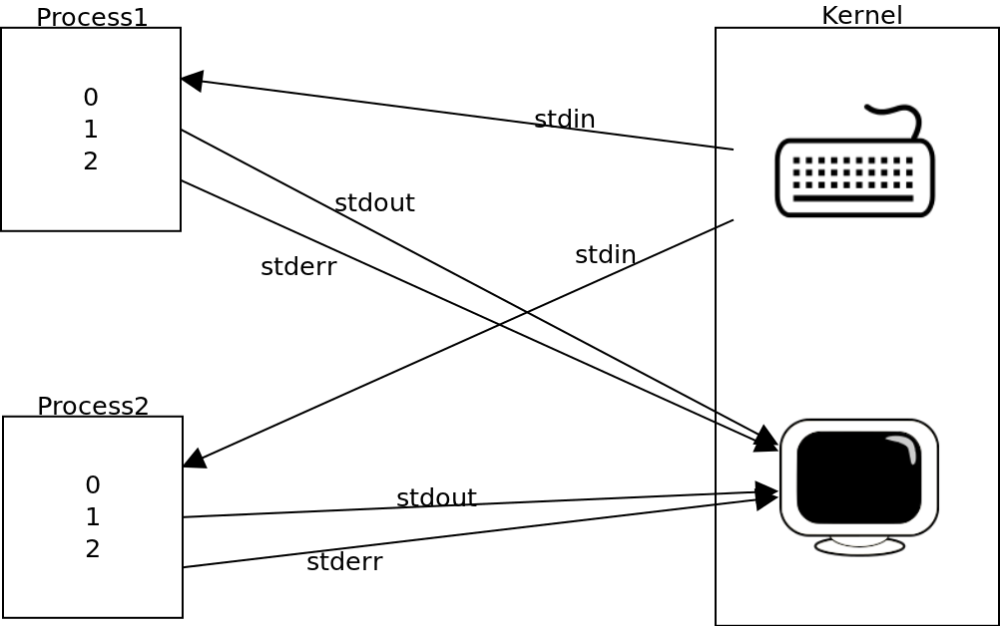

# Linux Command

## Common Commands

### `cd`

- `cd -` changes the current working directory to the previous working directory

### `diff`

- `diff` show the difference
  - For example: `diff <(ls foo) <(ls bar)` will show differences between files in dirs `foo` and `bar`.

```shell
touch foo/x bar/y
# Show differences between files in foo and bar
diff <(ls foo) <(ls bar)
# Outputs
# < x
# ---
# > y
```

### `find`

- `find` finding files or directories.

```bash
# Find all directories named src
find . -name src -type d
# Find all python files that have a folder named test in their path
find . -path '*/test/*.py' -type f
# Find all files modified in the last day
find . -mtime -1
# Find all log files have the size greater than 1G
find . -name "*.log" -size +1G
# Find all zip files with size in range 500kB to 10MB
find . -size +500k -size -10M -name '*.tar.gz'
```

- `find` can also perform actions over files that match your query.

```bash
# Delete all files with .tmp extension
find . -name '*.tmp' -exec rm {} \;
# Find all PNG files and convert them to JPG
find . -name '*.png' -exec convert {} {}.jpg \;
```

### `grep`

- Find the word `length` in all the csv files

```bash
bash-5.2$ grep length ./data/*.csv
# ./data/data1.csv:"sepal.length","sepal.width","petal.length","petal.width","variety"
# ./data/data2.csv:"sepal.length","sepal.width","petal.length","petal.width","variety"
```

### `man`

- `man` to view the user guide of commands
  - For example: `man ls`
  - Search: `/`type to search type → Press `n` to next
  - Press `q` to exit

### `source`

- `source filename.sh` reads and executes commands from `filename.sh` script in the current shell environment.
  - For example: inside the `filename.sh` has the function `mcd`, in other to execute the function `mcd` in the shell, you have to source the script first before invoke the function

```shell
source filename.sh # load the command in the filename.sh to the shell
mcd arg1 arg2      # call the function mcd of the script from the shell with "arg1" and "arg2"
```

### `rm`

- `rm` deletes directories that may contain content such as files and subdirectories
  - `-r` recursively delete the contents of a directory (whether it's files or subdirectories)
- `rmdir` ONLY deletes empty directories.

```shell
# remove a file
rm test.txt

# remove a directory with contents
rm -r test_folder

# remove empty directory
rm -d test_folder
rmdir test_folder
```

### `touch`

- `touch` to create a new file
  - Example: `touch project{1,2}/src/test/test{1,2,3}.py`

### `which`

- `which` or `whereis` to find the location of source/binary file of a command and manuals sections for a specified file in Linux system, specified in `PATH`
  - Special case: `which source` will return empty as source is a shell built-in command. The which command looks for binaries on the `PATH`, like in /usr/bin, /bin, /sbin, etc

```shell
which docker
# /usr/local/bin/docker
whereis docker
# docker: /usr/local/bin/docker
which source
# return empty as source is a shell built-in command
```

## Special Commands

### Download Files with `curl` and `wget`

- Both `curl` (work best for MacOS) and `wget` are command-line tools used for downloading files from the internet.

#### `curl`

- `-O` download a file in the current directory with its original name
- `-o` download a file in the current directory under a different name

```bash
$ curl -O http://example.com/logs/20231003.txt
# "20231003.txt" will be downloaded and stored locally as it is
curl -o log.txt http://example.com/logs/20231003.txt
# "20231003.txt" will be downloaded and stored as "log.txt" locally
```

- `-f` or `--fail`: Return an error status if the HTTP response code is an error (4xx or 5xx). Without this option, curl would still return success even if the HTTP response indicates an error.

```bash
# docker health check script
curl -f http://localhost:5001/health
```

- `-s` or `--silent` Silent or quiet mode.
  - It prevents curl from showing progress information or error messages.
- `S` or `--show-error`: Show error.
  - This option is used to display error messages when `-s` is also present. It makes sure that error messages are shown in case of failures.
- `-L` or `--location` This option instructs curl to follow HTTP redirects, meaning that if the server responds with a redirect

```bash
curl -fsSL https://get.docker.com -o get-docker.sh
```

#### `wget`

- By default, the `wget` command automatically downloads the requested resource into a file on your local machine

```bash
$ wget http://example.com/logs/20231003.txt
# "20231003.txt" will be downloaded and stored locally as it is
```

### File Descriptor

- `0`: `STDIN` (from the Key Board)
- `1`: `STDOUT` (display in the Monitor)
- `2`: `STDERR` (display in the Monitor)
  - For example: `bash run.sh >> logs/iris.log 2>&1` - `>> logs/iris.log` this will re-direct the `STDOUT` (`1`) from the process `run.sh` to the log file `iris.log` - `2>&1` this will re-direct the `STDERR` (`2`) to `STDOUT` (`1`), but from above, `STDOUT` (`1`) is re-directed to the log file, so `STDERR` (`2`) also be re-directed to the log file `iris.log`
  <p align="center"></p>

### File Writting

- `>` overwrites the file.
- `>>` appends to the file

```bash
echo "data science" >> ./data/test.txt # >> append
echo "math" > ./data/test.txt # > overwrite
```

- If you want to append multiple lines into a file, you can use `EOF`

```bash
cat << EOF >> ./data/test.txt # change << EOF >> to < EOF> will be overwrite
machine learning engineering
data engineering
EOF
```

### Glob

- Wildcards `?` (match one characters) and `*` (match any mount of characters)
- Example of `?`
  - Given files `foo`, `foo1`, `foo2`, `foo10` and `bar` in a folder
    - `rm foo?` will delete `foo1` and `foo2`
    - `rm foo*` will delete all but `bar`.
- Example of `*`
  - Search all the csv file inside **data** folder: `ls ./data/*.csv`

### Substitution

#### Command Substitution

- Command substitution: Whenever you place `$(CMD)` it will execute `CMD`, get the output of the command and substitute it in place.

```shell
bash-5.2$ echo "We are at $(pwd)"
# We are at /Users/codexplore/repos/mlops/src/bash_scripts
```

#### Process Substitution

- `< (CMD)` lesser
  - In the below example, it will concat the commands from `ls` and `ls ..` and return to `cat`

```shell
cat <(ls) <(ls ..)
```

### `/dev/null`

- `/dev/null` is a virtual null device used to discard any output redirected to it.
- There are two types of output streams to redirect:
  - Standard output (stdout): `1`
  - Standard error (stderr): `2`
- To suppress one of these streams, we simply redirect it to `/dev/null` using the descriptor and `>` redirect operator:

```shell
command > /dev/null # default: suppress stdout
# echo 'Hello from CodeXplore' > /dev/null
command 1> /dev/null # suppress stdout

command 2> /dev/null # suppress stderr
# cat --INCORRECT_OPTION 2> /dev/null
```

- In order to suppress both streams in one command

```shell
command > /dev/null 2> /dev/null

# redirect "stdout" to /dev/null and then redirect "stderr" to "stdout"
# &1 notation means the destination is a file descriptor, not a file named 1
command > /dev/null 2> &1

# &>
command &> /dev/null
```
